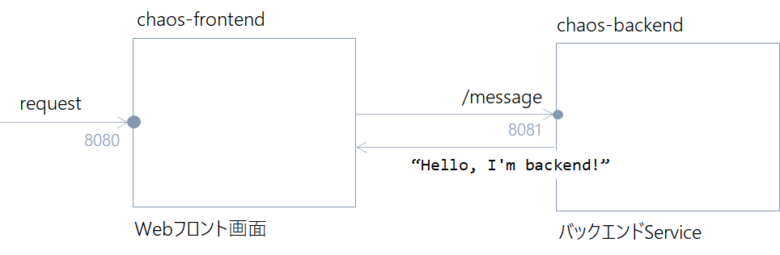
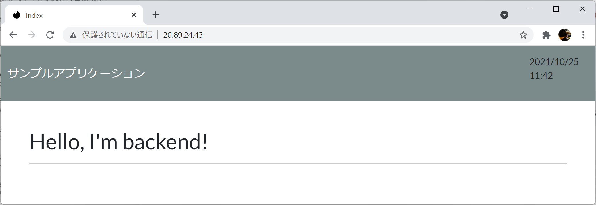
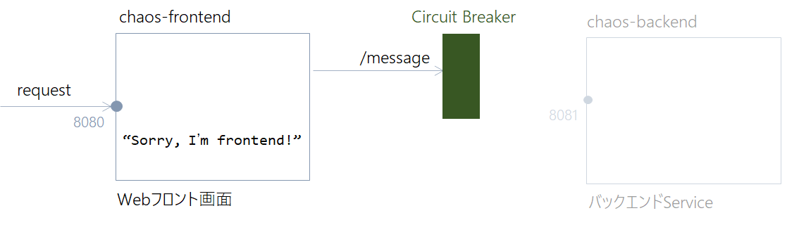

# Chaos Toolkit Sample using Azure Kubernetes Service/Spring Boot

[Azure Kubrnetes Service](https://docs.microsoft.com/ja-jp/azure/aks/)上で動くSpring Bootアプリケーションに対して[Chaos Toolkit](https://chaostoolkit.org/drivers/kubernetes/)を使ったカオス挿入を行います。

## Azure Kubrnetes Serviceクラスタの作成

次のコマンドでクラスタを作成します。

```bash
RG_NAME=aks-sample
AKS_NAME=aks-sample
az group create \
    --name $RG_NAME \
    --location japaneast

az aks create \
    --resource-group $RG_NAME \
    --name $AKS_NAME \
    --node-count 2 \
    --enable-addons monitoring \
    --generate-ssh-keys
```

クラスタが作成できたら、次のコマンドでクラスタの接続に必要なクレデンシャルを取得します。

```bash
az aks get-credentials \
    --resource-group $RG_NAME \
    --name $AKS_NAME
```

kubectlは、Kubernetesのリソースを操作するためのCLIです。次のコマンドを実行してkubectlをインストールし、クラスタのノード一覧を表示します。

```bash
az aks install-cli
kubectl get node
```


## Spring Bootによるコンテナアプリケーションの開発

### Build/Share

サンプルアプリは次の構成です。



chaos-frontendおよびchaos-backendをビルド/コンテナイメージを作成し、コンテナレジストリで共有します。
<your container registry name>は環境に合わせて変更してください。

```bash
ACR_NAME=<your container registry name>
```

#### backendアプリ

backendアプリのコンテナイメージを作成し、レジストリにPushします。

```bash
cd apps/backend
./mvnw spring-boot:build-image -Dspring-boot.build-image.imageName=$ACR_NAME/chaos-backend:v1
docker push $ACR_NAME/chaos-backend:v1
```

#### frontendアプリ(v1)

frontendのv1アプリのコンテナイメージを作成し、レジストリにPushします。

```bash
cd apps/frontend.before
./mvnw spring-boot:build-image -Dspring-boot.build-image.imageName=$ACR_NAME/chaos-frontend:v1
docker push $ACR_NAME/chaos-frontend:v1
```

#### frontendアプリ(v2)
frontendのv2アプリのコンテナイメージを作成し、レジストリにPushします。v2はResilience4jを利用してサーキットブレーカーを実装しています。

```bash
cd apps/frontend.after
./mvnw spring-boot:build-image -Dspring-boot.build-image.imageName=$ACR_NAME/chaos-frontend:v2
docker push $ACR_NAME/chaos-frontend:v2
```

### Kubernetesクラスタへのデプロイ

次のコマンドでクラスタの構成を確認します。

```bash
kubectl get svc,deployment,pod
```

クラスタにはまだアプリケーションが何もデプロイされていません。


#### backendアプリのデプロイ

Kubernetesマニフェストからbackendアプリをクラスタにデプロイします。

```bash
cd manifest/backend

kubectl apply -f service.yaml -f deployment.yaml 
```

DeploymentとServiceを確認します。

```bash
kubectl get deploy,service
```

#### frontendアプリのデプロイ

Kubernetesマニフェストからfrontアプリをクラスタにデプロイします。ここではv1のイメージを使います。

```bash
cd manifest/frontend

kubectl apply -f service.yaml -f deployment.yaml 
```

```yaml
spec:
  containers:
    - image: asashiho/chaos-frontend:v1
      imagePullPolicy: Always
      name: front
```

DeploymentとServiceを確認します。

```bash
kubectl get deploy,service
```

### 動作確認

frontendアプリのエンドポイントを確認します。

```bash
kubectl get svc
```

Webブラウザから次のURLにアクセスします。

```bash
http://<frontend External IP>/
```



動いているアプリケーションのログを確認するには、次のコマンドを実行します。

```bash
kubectl logs -f <pod name>
```


# Chaos Toolkitによるカオス挿入

Chaos Toolkitを使って、Kubernetesクラスタにカオスを挿入します。

## 環境構築

次のコマンドを実行し、Chaos Toolkitの環境を作成します。
```bash
python3 -m venv ~/.venvs/chaostk
source ~/.venvs/chaostk/bin/activate

pip install -U chaostoolkit
chaos --version

export KUBECONFIG=~/.kube/config
```

## 1. Podの削除

動作しているfrontend Podを削除し、システムの状態を確認します。

```bash
cd chaos
chaos run experiment.pod.json
```

```bash
chaos run experiment.pod.json 
[2021-10-25 10:15:24 INFO] Validating the experiment's syntax
[2021-10-25 10:15:44 INFO] Experiment looks valid
....
[2021-10-25 10:15:47 INFO] Playing your experiment's method now...
[2021-10-25 10:15:47 INFO] Action: stop-backend-service
[2021-10-25 10:15:47 INFO] Pausing after activity for 10s...
[2021-10-25 10:15:57 INFO] Probe: all-services-are-healthy
[2021-10-25 10:15:57 INFO] Steady state hypothesis: Services are all available and healthy
[2021-10-25 10:15:57 INFO] Probe: all-services-are-healthy
[2021-10-25 10:15:58 INFO] Probe: front-service-must-still-respond
[2021-10-25 10:15:58 INFO] Steady state hypothesis is met!
[2021-10-25 10:15:58 INFO] Let's rollback...
[2021-10-25 10:15:58 INFO] No declared rollbacks, let's move on.
[2021-10-25 10:15:58 INFO] Experiment ended with status: completed
```

Podの状態を確認します。
ChaosToolkitによって、動作している`front-54758ddbc9-vxk7q`が削除されていますが、それを検知したReplicaSet Controllerが新たなPodである`front-54758ddbc9-rj2c9`を起動しています。

```bash
front-54758ddbc9-vxk7q   1/1     Terminating         0          44s
front-54758ddbc9-rj2c9   0/1     Pending             0          0s
front-54758ddbc9-rj2c9   0/1     Pending             0          0s
front-54758ddbc9-rj2c9   0/1     ContainerCreating   0          0s
front-54758ddbc9-vxk7q   0/1     Terminating         0          47s
front-54758ddbc9-rj2c9   1/1     Running             0          3s
front-54758ddbc9-vxk7q   0/1     Terminating         0          49s
front-54758ddbc9-vxk7q   0/1     Terminating         0          49s
```

Kubernetesの自己修復機能によりシステムが復旧し、frontendアプリがエラーなくサービスを継続出来ていることが分かります。


## 2. Deploymentの削除

### サーキットブレーカーのないケース
次にChaos Toolkitを使ってDeploymentリソースを削除して、システムの状態を確認します。Deploymentリソースが喪失するケースとしては、CI/CD Pipeline実行時のトラブルや、オペレーションミスなどが想定されます。また、今回のサンプルではfrontendアプリが内部でbackendアプリを呼び出しデータを取得しているため、例えばfrontendがクラスタ外で提供されている外部APIを呼び出しているものの、通信先サービスのネットワークエラー/システム障害/メンテナンスなどで、一時的に応答を返せなくなったケースなどもあてはまります。


```java
public Mono<String> getApiData() {
    return webClient.get()
            .uri("http://backend:8081/message")
            .retrieve()
            .bodyToMono(String.class);
```

まず、現在のPodの状態を確認します。

```bash
kubectl get pod

NAME                     READY   STATUS    RESTARTS   AGE
back-6cc87c6f6f-g2ck4    1/1     Running   0          19m
front-54758ddbc9-rj2c9   1/1     Running   0          18m
```

次のコマンドを実行し、Chaos Toolkitを使って動作しているfrontend Deploymentを削除し、システムの状態を確認します。

```bash
chaos run experiment.deployment.json
```

```bash
[2021-10-25 10:37:52 INFO] Validating the experiment's syntax
[2021-10-25 10:38:10 INFO] Experiment looks valid
[2021-10-25 10:38:10 INFO] Running experiment: System is resilient to backend failures
....
[2021-10-25 10:38:10 INFO] Playing your experiment's method now...
[2021-10-25 10:38:10 INFO] Action: stop-backend-service
[2021-10-25 10:38:10 INFO] Pausing after activity for 10s...
[2021-10-25 10:38:20 INFO] Probe: all-services-are-healthy
[2021-10-25 10:38:21 INFO] Steady state hypothesis: Services are all available and healthy
[2021-10-25 10:38:21 INFO] Probe: all-services-are-healthy
[2021-10-25 10:38:21 INFO] Probe: front-service-must-still-respond
[2021-10-25 10:38:22 CRITICAL] Steady state probe 'front-service-must-still-respond' is not in the given tolerance so failing this experiment
[2021-10-25 10:38:22 INFO] Experiment ended with status: deviated
[2021-10-25 10:38:22 INFO] The steady-state has deviated, a weakness may have been discovered
```

Podを確認すると、backend Deploymentが削除されたため、frontendのみ動作している状態となります。

```bash
kubectl get pod
NAME                     READY   STATUS    RESTARTS   AGE
front-54758ddbc9-rj2c9   1/1     Running   0          23m
```

これにより、frontendアプリが通信先のbackendサービスからデータを取得できなくなり、サービスが継続出来ていることが分かります。

```bash
[2021-10-25 10:38:22 CRITICAL] Steady state probe 'front-service-must-still-respond' is not in the given tolerance so failing this experiment
```


### サーキットブレーカーのあるケース
このサンプルでは、Deploymentリソースの喪失でシステムが停止することがわかりました。これを是正するためサーキットブレーカーを導入します。




> サーキットブレーカーの詳細は[Microsoft Azureのサーキット ブレーカー パターン](https://docs.microsoft.com/ja-jp/azure/architecture/patterns/circuit-breaker)にまとまっています。

---

まず、停止したbackend Deploymentを復旧します。

```bash
kubectl apply -f manifest/backend/deployment.yaml
```

```bash
kubectl get po
NAME                     READY   STATUS    RESTARTS   AGE
back-6cc87c6f6f-x27fd    1/1     Running   0          4s
front-54758ddbc9-rj2c9   1/1     Running   0          39m
```

frontendアプリのv2の実装を確認します。[Resilience4j](https://github.com/resilience4j/resilience4j)は、Javaによるフォールトトレランスライブラリです。サーキットブレーカーだけでなくリトライ処理やハルクヘッドなどをサポートしています。このResilience4jは、Spring MVCとSpring Webfluxで使用可能です。

たとえば、JavaのClassで設定する場合、`slidingWindow`で設定したcallの成功/失敗を保存し、失敗の確率が`failureRateThreshold`に達すると、サーキットブレーカーを`OPEN`にし、アプリケーションに例外を返します。

この例では、10回中の80%のリクエストに失敗すると、例外を返します。

```java
@Configuration
public class CircuitConfig {

    @Bean
    public CircuitBreakerRegistry circuitBreakerRegistry() {
        return CircuitBreakerRegistry.of(
                CircuitBreakerConfig.custom()
                    .slidingWindowSize(10)
                    .failureRateThreshold(80)
                    .build()
        );
    }
}
```

`circuitBreaker`メソッドは、引数で指定したサーキットブレーカーが存在しない場合は新しく作成し、既に存在する場合は、そのオブジェクトを返します。

ここでは、サーキットブレーカーレジストリを介して`frontbreaker`という名前のサーキットブレーカーを作成します。

```java
@Bean
public CircuitBreaker circuitBreaker(CircuitBreakerRegistry circuitBreakerRegistry) {
    return circuitBreakerRegistry.circuitBreaker("frontbreaker");
}
```

backendのサービスを呼び出すときは、`@CircuitBreaker`アノテーションを使用するか、Operetorを使って指定します。

`transform`メソッドチェーンを利用して`CircuitBreakerOperator.of(circuitBreaker)`を利用すると、サーキットブレーカーが適応されます。
ここで、`api.getApiData`の処理でサーキットブレーカーが`OPEN`になると、`onErrorResume`で指定した`fallback`メソッドを呼び出します。

```java
public Mono<String> getData() {
    CircuitBreaker circuit = circuitBreakerRegistry.circuitBreaker("frontbreaker");

    return api.getApiData()
            .transform(CircuitBreakerOperator.of(circuit))
            .onErrorResume(this::fallback);
}

public Mono<String> fallback(Throwable t) {
    log.error("Fallback : " + t.getMessage());
    return Mono.just("Sorry...I'm frontend.");
}
```


このアプリが有効になるよう、frontend Deploymentのコンテナイメージのバージョンを`v1`から`v2`に変更します。

```bash
code manifest/frontend/deployment.yaml
```

```yaml
# 変更前
containers:
- image: <your container registry name>/chaos-frontend:v1

# 変更後
containers:
- image: <your container registry name>/chaos-frontend:v2
```

```bash
kubectl apply -f manifest/frontend/deployment.yaml
```

次のコマンドを実行し、Chaos Toolkitを使って動作しているfrontend Deploymentを削除し、システムの状態を確認します。

```bash
chaos run experiment.deployment.json
```

```bash
chaos run experiment.deployment.json
[2021-10-25 11:08:07 INFO] Validating the experiment's syntax
[2021-10-25 11:08:15 INFO] Experiment looks valid
....
[2021-10-25 11:08:16 INFO] Playing your experiment's method now...
[2021-10-25 11:08:16 INFO] Action: stop-backend-service
[2021-10-25 11:08:17 INFO] Pausing after activity for 10s...
[2021-10-25 11:08:27 INFO] Probe: all-services-are-healthy
[2021-10-25 11:08:27 INFO] Steady state hypothesis: Services are all available and healthy
[2021-10-25 11:08:27 INFO] Probe: all-services-are-healthy
[2021-10-25 11:08:27 INFO] Probe: front-service-must-still-respond
[2021-10-25 11:08:28 INFO] Steady state hypothesis is met!
[2021-10-25 11:08:28 INFO] Let's rollback...
[2021-10-25 11:08:28 INFO] No declared rollbacks, let's move on.
[2021-10-25 11:08:28 INFO] Experiment ended with status: completed
```

Podを確認すると、backend Deploymentが削除されたため、frontendのみ動作している状態ですが、frontendがリクエストをクライアントに返しているため、サービスが提供されつづけていることが分かります。

```bash
kubectl get pod
NAME                     READY   STATUS    RESTARTS   AGE
front-55bd94d9c8-8dkjz   1/1     Running   0          3m38s
```

Webブラウザから次のURLにアクセスします。

```bash
http://<frontend External IP>/
```


# クリーンアップ

検証が終わりクラスタが不要になったらクラスタのリソースグループを削除します。

```bash
RG_NAME=aks-sample
az group delete --name $RG_NAME 
```

---
Enjoy! 🍖🍺
